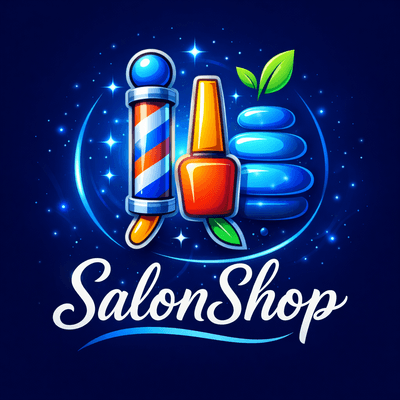



    

  # SalonShop

  ### The booking and payments platform built for independent beauty professionals

  *Book smarter. Get paid faster. Grow your clientele.*

---

## What is SalonShop?

SalonShop is an all-in-one operating platform for independent stylists, barbers, estheticians, nail techs, and salon owners. It brings together client booking, payments, and business management into a single beautifully designed experience — removing the friction that costs beauty professionals time and money every single day.

Whether you are running a solo booth or managing a team of stylists, SalonShop gives you the tools to run a professional, modern business from your phone or computer.

---

## The Problem We Solve

Independent beauty professionals are some of the hardest-working people in any industry — yet most of them are still managing bookings through Instagram DMs, collecting cash or Venmo, and chasing clients manually. They deserve better tools.

SalonShop eliminates that chaos. Everything a beauty professional needs to get booked, get paid, and get ahead is in one place.

---

## Core Value

| For the Professional | For the Client |
| --- | --- |
| Accept bookings 24/7 — no phone tag | Find and book verified stylists instantly |
| Get paid via card, deposit, or tip — all tracked | Pay securely online, no awkward cash moments |
| View earnings, appointments, and clients in one dashboard | See portfolios, reviews, and real availability |
| Send automated reminders and reduce no-shows | Receive reminders and manage bookings from any device |
| Build a public profile that works like a storefront | Discover new talent nearby with real reviews |

---

## Key Features

### For Beauty Professionals

- Smart booking calendar with real-time availability
- Stripe-powered payments with automatic payout splits
- Deposit collection to protect against no-shows
- Client history, notes, and loyalty tracking
- Portfolio showcase and public profile page
- Earnings analytics and performance insights
- Payroll and tip management for multi-stylist shops

### For Clients

- Instant booking with live availability
- Transparent pricing and service menus
- Secure card payments and receipts
- Review and rating system
- Mobile-first experience that works on any device

---

## The Opportunity

The beauty industry generates **over \ billion annually** in the United States alone, with the vast majority of transactions still happening through outdated or disconnected tools. Independent professionals represent the fastest-growing segment — and they are actively looking for a platform that treats their business with the same seriousness they do.

SalonShop is positioned to be the operating system for this market.

---

## Product Preview

Live demo: **[https://debalent.github.io/SalonShop](https://debalent.github.io/SalonShop)**

---

  SalonShop is proprietary intellectual property. All rights reserved.

